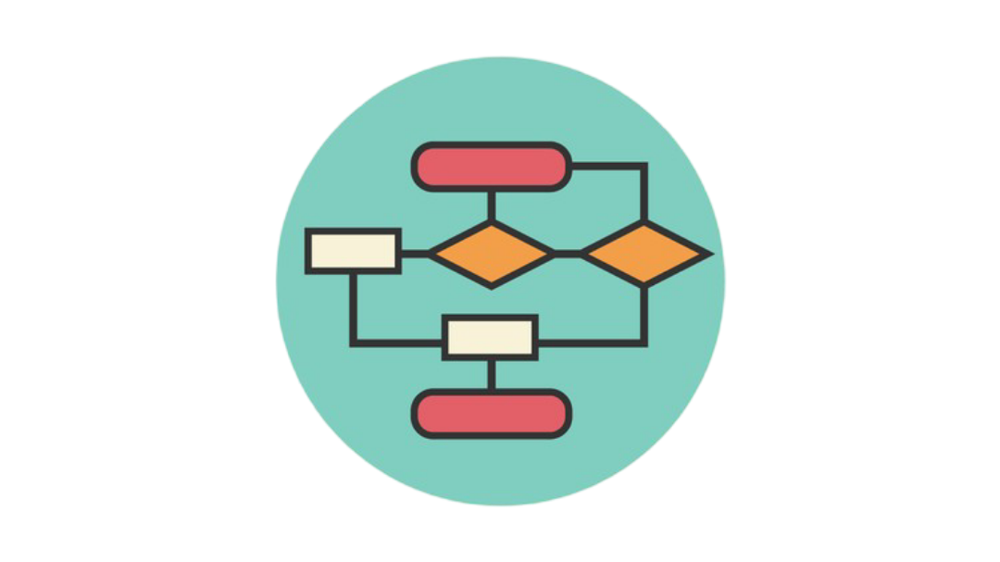

<style>

.slidev-layout::after {
  content: '';
  position: fixed;
  bottom: 20px;
  left: 20px;
  width: 60px;
  height: 60px;
  background-image: url('./assets/logo_afup.png');
  background-size: contain;
  background-repeat: no-repeat;
  opacity: 0.8;
  z-index: 100;
}
</style>

<div class="h-full flex flex-col items-center justify-center -m-10 p-10 bg-white">

  

  <div class="text-5xl font-bold mb-3" style="color: #4a3333;">
    <span class="font-mono" style="color: #5bbfba;">O(1)</span> à <span class="font-mono" style="color: #c94c4c;">O(Mon Dieu)</span>
  </div>

  <div class="text-2xl mb-4" style="color: #4a3333;">Voyage au bout de la lenteur</div>

  <div class="flex items-center gap-3 mb-6">
    <div class="w-12 h-0.5" style="background-color: #5bbfba;"></div>
    <div class="text-lg font-semibold" style="color: #5bbfba;">AFUP Day 2026</div>
    <div class="w-12 h-0.5" style="background-color: #5bbfba;"></div>
  </div>

</div>

---

# Des questions qu'on s'est tous posées...

<div class="mt-12 space-y-4 max-w-2xl mx-auto">

<v-click>

<div class="text-2xl text-black">🤔 Pourquoi mon code est-il <span class="text-red-500 font-bold">si lent</span> ?</div>

</v-click>

<v-click>

<div class="text-2xl text-black">🙃 Pourquoi est-ce lent en local mais rapide en prod ?</div>

</v-click>

</div>

---

# Qui suis-je ?

<div class="flex flex-col items-center mt-8">

<div class="relative">
  <div class="w-40 h-40 rounded-full p-1 bg-gradient-to-br from-purple-500 via-pink-500 to-orange-400 shadow-2xl">
    
  </div>
  <div class="absolute -bottom-2 -right-2 bg-green-500 text-white text-xs px-3 py-1 rounded-full shadow-lg flex items-center gap-1">
    <span class="w-2 h-2 bg-white rounded-full animate-pulse"></span> Speaker
  </div>
</div>

<div class="text-3xl font-bold mt-6 bg-gradient-to-r from-purple-600 to-pink-600 bg-clip-text text-transparent">
  Ismaile Abdallah
</div>

<div class="flex flex-wrap justify-center gap-3 mt-6">

<div class="bg-gradient-to-r from-purple-500 to-indigo-600 text-white px-4 py-2 rounded-full text-lg font-semibold shadow-lg transform hover:scale-105 transition-transform">
  🐘 Backend Engineer
</div>

<div class="bg-gradient-to-r from-orange-500 to-red-500 text-white px-4 py-2 rounded-full text-lg font-semibold shadow-lg transform hover:scale-105 transition-transform">
   ✍️ @Yousign....♻️@Youtrust
</div>

</div>

</div>

---

# Au programme aujourd'hui

<div class="grid grid-cols-4 gap-6 mt-16">

<div v-motion :initial="{ opacity: 0, y: 20 }" :enter="{ opacity: 1, y: 0, transition: { delay: 300 } }" class="bg-gray-50 rounded-2xl p-6 shadow text-center border">
  <div class="text-4xl mb-4">📊</div>
  <div class="text-lg font-semibold text-black">Notation Big O</div>
</div>

<div v-motion :initial="{ opacity: 0, y: 20 }" :enter="{ opacity: 1, y: 0, transition: { delay: 600 } }" class="bg-gray-50 rounded-2xl p-6 shadow text-center border">
  <div class="text-4xl mb-4">🎯</div>
  <div class="text-lg font-semibold text-black">Complexités</div>
</div>

<div v-motion :initial="{ opacity: 0, y: 20 }" :enter="{ opacity: 1, y: 0, transition: { delay: 900 } }" class="bg-gray-50 rounded-2xl p-6 shadow text-center border">
  <div class="text-4xl mb-4">💡</div>
  <div class="text-lg font-semibold text-black">Exemples</div>
</div>

<div v-motion :initial="{ opacity: 0, y: 20 }" :enter="{ opacity: 1, y: 0, transition: { delay: 1200 } }" class="bg-gray-50 rounded-2xl p-6 shadow text-center border">
  <div class="text-4xl mb-4">🛠️</div>
  <div class="text-lg font-semibold text-black">Optimisation</div>
</div>

</div>

<div v-motion :initial="{ opacity: 0 }" :enter="{ opacity: 1, transition: { delay: 1500 } }" class="text-center mt-8 text-sm text-gray-400">
  + Bonus : <span class="font-mono">P vs NP</span> &amp; <span class="font-mono">RSA</span>
</div>


---

# Comment mesurer l'efficacité d'un algorithme ?

<v-click>

<div class="flex items-center justify-center gap-6 mt-12 mb-8">
  <span class="text-6xl">⏱️</span>
  <span class="text-2xl text-black">Avec un chronomètre ?</span>
</div>

</v-click>

<v-click>

<div class="text-center text-xl text-red-600 font-bold mb-6">❌ Mauvaise idée !</div>

</v-click>

<div class="grid grid-cols-2 gap-6 max-w-3xl mx-auto">

<v-click>

<div class="flex items-center gap-4 bg-blue-50 rounded-xl p-4 border border-blue-100">
  <span class="text-3xl">💻</span>
  <span class="text-black"><strong>Mon PC local</strong><br><span class="text-gray-500 text-sm">RAM limitée, CPU parfois occupé</span></span>
</div>

</v-click>

<v-click>

<div class="flex items-center gap-4 bg-green-50 rounded-xl p-4 border border-green-100">
  <span class="text-3xl">🏢</span>
  <span class="text-black"><strong>Datacenter</strong><br><span class="text-gray-500 text-sm">Beaucoup de RAM, CPU puissant</span></span>
</div>

</v-click>

</div>

<v-after>

<div class="text-center mt-8 text-gray-700">Le même algorithme = <span class="font-bold text-red-500">temps différents</span></div>

</v-after>

<v-click>

<div class="text-center mt-6 text-2xl font-bold text-indigo-600">→ On a besoin du Big O !</div>

</v-click>

---

# Big O : La vraie définition 🤓

<v-click>

<div class="bg-gray-100 rounded-2xl p-8 border-2 border-gray-300 max-w-3xl mx-auto mt-8">
  <div class="text-center text-xl text-gray-800 font-mono leading-relaxed">
    On note <strong>u<sub>n</sub> = O(v<sub>n</sub>)</strong> quand il existe <strong>n₀ ∈ ℕ</strong> et un réel <strong>k > 0</strong> tel que :
  </div>
  <div class="text-center text-3xl mt-6 font-mono text-gray-900">
    ∀n ≥ n₀, |u<sub>n</sub>| ≤ k|v<sub>n</sub>|
  </div>
</div>

</v-click>

<v-click>

<div class="text-center mt-12">
  
</div>

</v-click>

---

# Big O 📈

<v-click>

<div class="bg-blue-50 rounded-xl p-5 border border-blue-200 max-w-3xl mx-auto mb-4">
  <div class="text-lg text-black">Le <span class="font-bold">"O"</span> majuscule indique une <span class="font-bold text-indigo-600">borne supérieure</span> — c'est une approximation du pire cas.</div>
</div>

</v-click>

<v-after>

<div class="bg-green-50 rounded-xl p-5 border border-green-200 max-w-3xl mx-auto mb-4">
  <div class="text-lg text-black"><span class="font-bold text-green-600">n</span> = le nombre d'éléments en entrée (taille du tableau, lignes en BDD, utilisateurs...)</div>
  <div class="text-gray-600 mt-2">O(n) décrit comment le temps évolue quand <span class="font-bold">n</span> augmente</div>
</div>

</v-after>

<v-click>

<div class="bg-gray-50 rounded-xl p-5 border max-w-3xl mx-auto">
  <div class="text-sm text-gray-500 mb-2">📚 Un peu d'histoire...</div>
  <div class="text-black">Notation inventée par <span class="font-bold">Paul Bachmann</span> (1894)</div>
  <div class="text-black mt-1">Popularisée par <span class="font-bold">Edmund Landau</span> (1909)</div>
  <div class="text-indigo-600 mt-3 font-semibold">→ D'où le nom : "Notation de Landau" ou "Big O notation"</div>
</div>

</v-click>

---

# Calculer une complexité — Checklist 🧠

<div class="text-center text-xl text-indigo-700 italic mb-6">« À quel point ce code va-t-il scaler ? »</div>

<div class="grid grid-cols-2 gap-8 max-w-5xl mx-auto items-start">

<div>

```php
function hasDuplicate(array $users): bool
{
    foreach ($users as $u1) {
        foreach ($users as $u2) {
            if ($u1->id !== $u2->id
                && $u1->email === $u2->email) {
                return true;
            }
        }
    }
    return false;
}
```

</div>

<div class="space-y-3 text-base">
  <div class="flex gap-3 items-baseline"><span class="font-bold text-blue-600">1️⃣</span><span>Identifier <code>n</code></span></div>
  <div class="flex gap-3 items-baseline"><span class="font-bold text-green-600">2️⃣</span><span>Repérer les ops <code>O(1)</code></span></div>
  <div class="flex gap-3 items-baseline"><span class="font-bold text-yellow-600">3️⃣</span><span>Compter les boucles</span></div>
  <div class="flex gap-3 items-baseline"><span class="font-bold text-teal-600">4️⃣</span><span>Simplifier</span></div>
</div>

</div>

---

# 1️⃣ Identifier ce qui grandit — <span class="font-mono bg-blue-200 px-2 rounded">n</span>

<div class="grid grid-cols-2 gap-8 max-w-5xl mx-auto items-start">

<div>

```php {1|3|all}
function hasDuplicate(array $users): bool
{
    foreach ($users as $u1) {
        foreach ($users as $u2) {
            if ($u1->id !== $u2->id
                && $u1->email === $u2->email) {
                return true;
            }
        }
    }
    return false;
}
```

</div>

<div class="space-y-3">

<v-click>

<div class="bg-blue-50 rounded-xl p-4 border-2 border-blue-300">
  <div class="text-blue-800 font-bold mb-1">L'entrée qui peut grandir</div>
  <div class="font-mono text-blue-900">n = count($users)</div>
</div>

</v-click>

<v-click>

<div class="text-sm text-gray-600 mt-2">
  Dans la vraie vie, <code>n</code> peut être :
  <span class="text-black">taille d'un tableau, lignes en BDD, résultats d'API, nombre d'utilisateurs…</span>
</div>

</v-click>

</div>

</div>

---

# 2️⃣ Repérer les opérations élémentaires

<div class="grid grid-cols-2 gap-8 max-w-5xl mx-auto items-start">

<div>

```php {5-6|7|all}
function hasDuplicate(array $users): bool
{
    foreach ($users as $u1) {
        foreach ($users as $u2) {
            if ($u1->id !== $u2->id
                && $u1->email === $u2->email) {
                return true;
            }
        }
    }
    return false;
}
```

</div>

<div class="space-y-3">

<v-click>

<div class="bg-green-50 rounded-xl p-4 border-2 border-green-300">
  <div class="text-green-800 font-bold mb-2">Chaque op simple = <span class="font-mono">O(1)</span></div>
  <div class="text-sm text-gray-700 space-y-1">
    <div><code>$u1->id !== $u2->id</code></div>
    <div><code>$u1->email === $u2->email</code></div>
    <div><code>&&</code></div>
  </div>
  <div class="text-xs text-green-700 mt-2">→ peu importe <code>count($users)</code>, le coût ne bouge pas.</div>
</div>

</v-click>

<v-click>

<div class="text-sm text-gray-600 mt-2">
  <strong>O(1)</strong> regroupe : arithmétique, affectations, comparaisons, conditions, appel de fonction simple.
</div>

</v-click>

</div>

</div>

---

# 3️⃣ Les boucles

<div class="grid grid-cols-2 gap-8 max-w-5xl mx-auto items-start">

<div>

```php {3|3-9|all}
function hasDuplicate(array $users): bool
{
    foreach ($users as $u1) {
        foreach ($users as $u2) {
            if ($u1->id !== $u2->id
                && $u1->email === $u2->email) {
                return true;
            }
        }
    }
    return false;
}
```

</div>

<div class="space-y-3">

<v-click>

<div class="bg-yellow-50 rounded-xl p-4 border-2 border-yellow-300">
  <div class="text-yellow-800 font-bold mb-1">Boucle externe</div>
  <div class="text-sm text-gray-700"><code>foreach ($users as $u1)</code> → <strong>n itérations</strong></div>
</div>      

</v-click>

<v-click>

<div class="bg-red-50 rounded-xl p-4 border-2 border-red-300">
  <div class="text-red-800 font-bold mb-1">Boucle imbriquée</div>
  <div class="text-sm text-gray-700"><code>foreach ($users as $u2)</code> → <strong>n × n itérations</strong></div>
  <div class="font-mono text-base text-black mt-2">n × n × O(1)</div>
</div>

</v-click>

<v-click>

<div class="bg-gray-50 rounded-xl p-3 border-2 border-gray-300 mt-2">
  <div class="text-gray-800 text-sm font-bold mb-1">Complexité totale (sans simplification)</div>
  <div class="font-mono text-base text-black">3 ops × n × n + 1 = <strong>3n² + 1</strong></div>
</div>

</v-click>

</div>

</div>

---

# 4️⃣ Simplifier : constantes & terme dominant

<div class="grid grid-cols-2 gap-8 max-w-5xl mx-auto items-start">

<div>

```php {all}
function hasDuplicate(array $users): bool
{
    foreach ($users as $u1) {
        foreach ($users as $u2) {
            if ($u1->id !== $u2->id
                && $u1->email === $u2->email) {
                return true;
            }
        }
    }
    return false;
}
```

</div>

<div class="space-y-2">

<v-click>

<div class="bg-gray-50 rounded-xl p-3 border border-gray-300">
  <div class="text-sm text-gray-700 mb-1">On compte tout :</div>
  <div class="font-mono text-base text-black">3 ops × n × n + 1 = <strong>3n² + 1</strong></div>
</div>

</v-click>

<v-click>

<div class="bg-teal-50 rounded-xl p-3 border-2 border-teal-300">
  <div class="text-teal-800 text-sm font-bold mb-1">Règle 1 — ignorer les constantes</div>
  <div class="font-mono text-base text-black">3n² + 1 → <strong>3n²</strong></div>
</div>

</v-click>

<v-click>

<div class="bg-teal-50 rounded-xl p-3 border-2 border-teal-300">
  <div class="text-teal-800 text-sm font-bold mb-1">Règle 2 — garder le terme dominant</div>
  <div class="font-mono text-base text-black">3n² → <strong>n²</strong></div>
</div>

</v-click>

<v-click>

<div class="text-center mt-2">
  <span class="bg-red-500 text-white px-4 py-2 rounded-full text-lg font-bold">→ O(n²)</span>
</div>

</v-click>

</div>

</div>

<v-click>

<div class="mt-4 grid grid-cols-3 gap-3 max-w-3xl mx-auto text-center">
  <div class="bg-white rounded-lg p-2 border text-sm">
    <span class="font-mono text-gray-600">O(2n)</span>
    <span class="text-gray-400">→</span>
    <span class="font-mono font-bold text-teal-700">O(n)</span>
  </div>
  <div class="bg-white rounded-lg p-2 border text-sm">
    <span class="font-mono text-gray-600">O(n² + n)</span>
    <span class="text-gray-400">→</span>
    <span class="font-mono font-bold text-teal-700">O(n²)</span>
  </div>
  <div class="bg-white rounded-lg p-2 border text-sm">
    <span class="font-mono text-gray-600">O(2ⁿ + n²)</span>
    <span class="text-gray-400">→</span>
    <span class="font-mono font-bold text-red-600">O(2ⁿ)</span>
  </div>
</div>

</v-click>

---

# ‼️Le coût caché des opérations 🎭

<div class="text-center text-base text-indigo-700 italic mb-4">« Une fonction qu'on appelle a aussi sa propre complexité »</div>

<div class="grid grid-cols-2 gap-6 max-w-5xl mx-auto items-start">

<div class="space-y-3">

```php
function listOrdersWithUser(array $orders, array $users): array {
    $result = [];
    foreach ($orders as $o) { // n itérations
        $result[] = User::find($users, $o->user_id);
    }
    return $result;
}
```

<v-click>

```php
class User {
    public static function find(array $users, int $id): ?User {
        foreach ($users as $u) { // ← n itérations cachées !
            if ($u->id === $id) return $u;
        }
        return null;
    }
}
```

</v-click>

</div>

<div class="space-y-3">

<v-click>

<div class="bg-yellow-50 rounded-xl p-3 border-2 border-yellow-300">
  <div class="text-yellow-800 font-bold text-sm mb-1">Analyse à la légère</div>
  <div class="font-mono text-lg">1 boucle → <strong>O(n)</strong> ✓</div>
  <div class="text-xs text-yellow-700 mt-1">« Tranquille, c'est linéaire 😎 »</div>
</div>

</v-click>

<v-click>

<div class="bg-red-50 rounded-xl p-3 border-2 border-red-300">
  <div class="text-red-800 font-bold text-sm mb-1">En vrai...</div>
  <div class="font-mono text-base">n × <code>User::find</code> = n × O(n)</div>
  <div class="font-mono text-lg font-bold text-red-700 mt-1">= O(n²) 💀</div>
</div>

</v-click>

</div>

</div>

---

# Compter les opérations en PHP

<div class="grid grid-cols-2 gap-8 mt-6">

<v-click>

<div class="bg-green-50 rounded-2xl p-5 border-2 border-green-200">
  <div class="flex items-center gap-3 mb-3">
    <span class="bg-green-500 text-white px-3 py-1 rounded-full text-sm font-bold">O(1)</span>
    <span class="text-green-700 font-semibold">Constant</span>
    <span class="text-2xl">😎</span>
  </div>

```php
function findUser(array $users, int $id): ?User
{
    return $users[$id] ?? null;  // ← 1 opération O(1)
}
```

  <div class="text-green-600 text-sm mt-2">→ Accès direct par clé, peu importe la taille du tableau</div>
</div>

</v-click>

<v-click>

<div class="bg-yellow-50 rounded-2xl p-5 border-2 border-yellow-200">
  <div class="flex items-center gap-3 mb-3">
    <span class="bg-yellow-500 text-white px-3 py-1 rounded-full text-sm font-bold">O(n)</span>
    <span class="text-yellow-700 font-semibold">Linéaire</span>
    <span class="text-2xl">😐</span>
  </div>

```php
function processAll(array $arr): void
{
    foreach ($arr as $item) { // n opérations
        validate($item);
    }
    foreach ($arr as $item) { // + n opérations
        transform($item);
    }
}
```

  <div class="text-yellow-600 text-sm mt-2">→ 2n opérations = <strong>O(n)</strong></div>
</div>

</v-click>

</div>


---

# Quand ça devient critique...

<div class="max-w-2xl mx-auto mt-6">

<div class="relative min-h-[420px]">

<v-click>

<div class="absolute inset-0 bg-gray-100 rounded-2xl p-5 border-4 border-gray-500 shadow-lg shadow-gray-200 ">
  <div class="flex items-center gap-3 mb-3">
    <span class="bg-gray-500 text-white px-3 py-1 rounded-full text-sm font-bold">???</span>
    <span class="text-gray-600 font-semibold">Quelle complexité ?</span>
    <span class="text-2xl">🤔</span>
  </div>

  <div class="bg-white/70 rounded-lg p-2 mb-3 text-center text-sm">
    <span class="font-semibold text-gray-700">💡 Rappel : </span>
    <span class="font-mono text-gray-800">0, 1, 1, 2, 3, 5, 8, 13, 21, 34…</span>
    <div class="text-xs text-gray-500 mt-0.5">chaque terme = somme des deux précédents</div>
  </div>

```php
function fibonacci(int $n): int
{
    if ($n <= 1) {
        return $n;
    }
    return fibonacci($n - 1) + fibonacci($n - 2);
}
```

  <div class="bg-gray-100 rounded-lg p-2 mt-2 text-center">
    <span class="text-gray-500 font-semibold">? éléments = <strong>?</strong> opérations</span>
  </div>

</div>

</v-click>

<v-click>

<div class="absolute inset-0 bg-red-100 rounded-2xl p-5 border-4 border-red-500 shadow-lg shadow-red-200">
  <div class="flex items-center gap-3 mb-3">
    <span class="bg-red-600 text-white px-3 py-1 rounded-full text-sm font-bold animate-pulse">O(2ⁿ)</span>
    <span class="text-red-700 font-bold text-lg">Exponentiel</span>
    <span class="bg-red-600 text-white px-2 py-0.5 rounded text-xs font-bold uppercase tracking-wide">Critique!</span>
    <span class="text-2xl">🔥💀</span>
  </div>

```php
function fibonacci(int $n): int
{
    if ($n <= 1) {        // Cas de base O(1)
        return $n;
    }
    return fibonacci($n - 1) + fibonacci($n - 2);  // 2 appels récursifs !
}
```

  <div class="bg-red-100 rounded-lg p-2 mt-2 text-center border border-red-400">
    <span class="text-red-700 font-semibold">30 éléments = <strong class="text-red-700 text-lg">1 000 000 000</strong> opérations !</span>
  </div>

  <div class="bg-red-100 rounded-lg p-2 mt-2 text-center border border-red-400">
<span class="text-red-700 font-semibold">300 éléments = 2^300 est bien supérieur au nombre d’atomes de l’univers visible.</span>  </div>

</div>

</v-click>

</div>

</div>

<v-click>

<div class="text-center mt-5 bg-purple-100 rounded-xl p-3 border-2 border-purple-300 max-w-xl mx-auto">
  <span class="text-lg">💀 Ces complexités peuvent <strong class="text-purple-700">tuer votre serveur</strong> en prod</span>
</div>

</v-click>

---

# L'échelle de la douleur

<div class="flex justify-center items-end gap-3 mt-4">

<div class="flex flex-col items-center">
  <div class="bg-green-500 rounded-t-lg w-14 h-12 flex items-center justify-center text-xl shadow">😎</div>
  <div class="mt-2 text-xs font-mono text-black">O(1)</div>
  <div class="text-xs text-gray-500">Constant</div>
</div>

<div class="flex flex-col items-center">
  <div class="bg-green-400 rounded-t-lg w-14 h-20 flex items-center justify-center text-xl shadow">🙂</div>
  <div class="mt-2 text-xs font-mono text-black">O(log n)</div>
  <div class="text-xs text-gray-500">Logarithmique</div>
</div>

<div class="flex flex-col items-center">
  <div class="bg-yellow-400 rounded-t-lg w-14 h-28 flex items-center justify-center text-xl shadow">😐</div>
  <div class="mt-2 text-xs font-mono text-black">O(n)</div>
  <div class="text-xs text-gray-500">Linéaire</div>
</div>

<div class="flex flex-col items-center">
  <div class="bg-orange-400 rounded-t-lg w-14 h-36 flex items-center justify-center text-xl shadow">😰</div>
  <div class="mt-2 text-xs font-mono text-black">O(n log n)</div>
  <div class="text-xs text-gray-500">Linéarithmique</div>
</div>


<div class="flex flex-col items-center">
  <div class="bg-red-400 rounded-t-lg w-14 h-44 flex items-center justify-center text-xl shadow">😱</div>
  <div class="mt-2 text-xs font-mono text-black">O(n²)</div>
  <div class="text-xs text-gray-500">Quadratique</div>
</div>

<v-click>

<div class="w-1 h-60 bg-gray-300 mx-2"></div>

</v-click>

<div class="flex flex-col items-center">
  <div class="bg-red-600 rounded-t-lg w-14 h-52 flex items-center justify-center text-xl shadow">🔥</div>
  <div class="mt-2 text-xs font-mono text-black">O(2ⁿ)</div>
  <div class="text-xs text-gray-500">Exponentiel</div>
</div>


<div class="flex flex-col items-center">
  <div class="bg-purple-900 rounded-t-lg w-14 h-60 flex items-center justify-center text-xl shadow">💀</div>
  <div class="mt-2 text-xs font-mono text-black">O(n!)</div>
  <div class="text-xs text-gray-500">Factoriel (mon Dieu)</div>
</div>

</div>

<v-after>

<div class="flex justify-center mt-4">
  <div class="flex items-center gap-2">
    <div class="bg-green-100 rounded-xl px-4 py-2 border-2 border-green-300" style="margin-right: 180px;">
      <span class="text-green-700 font-bold font-mono">O(Ok)</span>
      <span class="text-green-600 text-sm ml-1">Polynomial</span>
    </div>
    <div class="bg-red-100 rounded-xl px-4 py-2 border-2 border-red-300">
      <span class="text-red-700 font-bold font-mono">O(Mon Dieu)</span>
      <span class="text-red-600 text-sm ml-1">Exponentiel</span>
    </div>
  </div>
</div>

</v-after>

---
layout: center
class: text-center
---

<div class="relative w-full flex justify-center items-center h-full">
  <svg viewBox="0 0 550 400" class="w-[650px] h-[480px]">

<!-- Axes -->
<line x1="50" y1="350" x2="450" y2="350" stroke="#333" stroke-width="2"/>
<line x1="50" y1="350" x2="50" y2="50" stroke="#333" stroke-width="2"/>

<!-- Labels axes -->
<text x="250" y="370" fill="#333" font-size="3" text-anchor="middle">Elements (n)</text>
<text x="35" y="200" fill="#333" font-size="3" text-anchor="middle" transform="rotate(-90, 35, 200)">Operations</text>

<!-- O(1) - Vert foncé - ULTRA RAPIDE -->
<path d="M 50 345 L 450 345" fill="none" stroke="#166534" stroke-width="2" pathLength="1" class="animated-path speed-1"/>
<text x="455" y="348" fill="#166534" font-size="3" class="label label-1">O(1)</text>

<!-- O(log n) - Vert - TRES RAPIDE -->
<path d="M 50 345 C 100 330, 200 320, 450 310" fill="none" stroke="#22c55e" stroke-width="2" pathLength="1" class="animated-path speed-2"/>
<text x="455" y="313" fill="#22c55e" font-size="3" class="label label-2">O(log n)</text>

<!-- O(n) - Vert clair - RAPIDE -->
<path d="M 50 345 L 450 280" fill="none" stroke="#65a30d" stroke-width="2" pathLength="1" class="animated-path speed-3"/>
<text x="455" y="283" fill="#65a30d" font-size="3" class="label label-3">O(n)</text>

<!-- O(n log n) - Jaune - MOYEN -->
<path d="M 50 345 C 150 340, 250 300, 350 220 C 400 170, 430 120, 450 100" fill="none" stroke="#ca8a04" stroke-width="2" pathLength="1" class="animated-path speed-4"/>
<text x="455" y="103" fill="#ca8a04" font-size="3" class="label label-4">O(n log n)</text>

<!-- O(n²) - Orange - LENT -->
<path d="M 50 345 C 100 340, 150 300, 200 220 C 250 140, 280 90, 300 60" fill="none" stroke="#ea580c" stroke-width="2" pathLength="1" class="animated-path speed-5"/>
<text x="305" y="63" fill="#ea580c" font-size="3" class="label label-5">O(n²)</text>

<!-- O(2^n) - Rouge - TRES LENT -->
<path d="M 50 345 C 80 340, 100 280, 120 180 C 135 100, 145 60, 155 50" fill="none" stroke="#dc2626" stroke-width="2" pathLength="1" class="animated-path speed-6"/>
<text x="160" y="53" fill="#dc2626" font-size="3" class="label label-6">O(2ⁿ)</text>

<!-- O(n!) - Rouge foncé - CATASTROPHE -->
<path d="M 50 345 C 60 320, 70 200, 80 100 C 85 70, 90 55, 95 50" fill="none" stroke="#991b1b" stroke-width="2" pathLength="1" class="animated-path speed-7"/>
<text x="100" y="53" fill="#991b1b" font-size="3" class="label label-7">O(n!)</text>

</svg>
</div>

<style>
.animated-path {
  stroke-dasharray: 1;
  stroke-dashoffset: 1;
  animation: draw 1s ease-out forwards;
  animation-delay: 0.5s;
}

.label {
  opacity: 0;
  animation: fadeIn 0.3s ease-out forwards;
}

@keyframes draw {
  from { stroke-dashoffset: 1; }
  to { stroke-dashoffset: 0; }
}

@keyframes fadeIn {
  from { opacity: 0; }
  to { opacity: 1; }
}

/* Durées différentes - toutes démarrent en même temps */
/* Écarts exponentiels pour montrer la vraie lenteur */
path.speed-1 { animation-duration: 0.3s; }   /* O(1) - instantané */
path.speed-2 { animation-duration: 0.8s; }   /* O(log n) - très rapide */
path.speed-3 { animation-duration: 2s; }     /* O(n) - linéaire */
path.speed-4 { animation-duration: 4s; }     /* O(n log n) - acceptable */
path.speed-5 { animation-duration: 8s; }     /* O(n²) - lent */
path.speed-6 { animation-duration: 12s; }    /* O(2^n) - très lent */
path.speed-7 { animation-duration: 16s; }    /* O(n!) - catastrophe */

/* Labels apparaissent quand leur courbe se termine */
text.label-1 { animation-delay: 0.8s; }
text.label-2 { animation-delay: 1.3s; }
text.label-3 { animation-delay: 2.5s; }
text.label-4 { animation-delay: 4.5s; }
text.label-5 { animation-delay: 8.5s; }
text.label-6 { animation-delay: 12.5s; }
text.label-7 { animation-delay: 16.5s; }
</style>

---

# hasDuplicate : O(n²) → O(n) 🎯

<div class="grid grid-cols-2 gap-4">

<v-click>

<div class="bg-red-50 rounded-xl p-4 border-2 border-red-300">
  <div class="flex items-center gap-2 mb-2">
    <span class="bg-red-500 text-white px-2 py-1 rounded-full text-sm font-bold">O(n²)</span>
    <span class="text-red-700 font-semibold">2 boucles imbriquées</span>
    <span class="text-lg">🐌</span>
  </div>

```php
function hasDuplicate(array $arr): bool
{
    foreach ($arr as $i => $a) {
        foreach ($arr as $j => $b) {
            if ($i !== $j && $a === $b) {
                return true;
            }
        }
    }
    return false;
}
```

  <div class="bg-red-100 rounded p-1.5 mt-2 text-center">
    <span class="text-red-700 text-sm">1K élts = <strong>1M</strong> ops</span>
  </div>
</div>

</v-click>

<v-click>

<div class="bg-green-50 rounded-xl p-4 border-2 border-green-300">
  <div class="flex items-center gap-2 mb-2">
    <span class="bg-green-500 text-white px-2 py-1 rounded-full text-sm font-bold">O(n)</span>
    <span class="text-green-700 font-semibold">Hash map</span>
    <span class="text-lg">🚀</span>
  </div>

```php
function hasDuplicate(array $arr): bool
{
    $seen = [];
    foreach ($arr as $value) {
        if (isset($seen[$value])) {
            return true;
        }
        $seen[$value] = true;
    }
    return false;
}
```

  <div class="bg-green-100 rounded p-1.5 mt-2 text-center">
    <span class="text-green-700 text-sm">1K élts = <strong>1K</strong> ops</span>
  </div>
</div>

</v-click>

</div>


---

# <code>in_array()</code> → <code>isset()</code> : O(n) → O(1)

<div class="grid grid-cols-2 gap-4">

<v-click>

<div class="bg-red-50 rounded-xl p-4 border-2 border-red-300">
  <div class="flex items-center gap-2 mb-2">
    <span class="bg-red-500 text-white px-2 py-1 rounded-full text-sm font-bold">O(n)</span>
    <span class="text-red-700 font-semibold">in_array()</span>
    <span class="text-lg">🐌</span>
  </div>

```php
$users = ['alice', 'bob', 'charlie', ...];
// Pas d'optimisation...
foreach ($orders as $order) {
    if (in_array($order->user, $users)) {}
}
```

  <div class="bg-red-100 rounded p-1.5 mt-2 text-center">
    <span class="text-red-700 text-sm">1K × 10K = <strong>10M</strong> ops</span>
  </div>
</div>

</v-click>

<v-click>

<div class="bg-green-50 rounded-xl p-4 border-2 border-green-300">
  <div class="flex items-center gap-2 mb-2">
    <span class="bg-green-500 text-white px-2 py-1 rounded-full text-sm font-bold">O(1)</span>
    <span class="text-green-700 font-semibold">isset()</span>
    <span class="text-lg">🚀</span>
  </div>

```php
$users = ['alice', 'bob', 'charlie', ...];
$map = array_flip($users); // O(n) 1 fois
foreach ($orders as $order) {
    if (isset($map[$order->user])) {}
}
```

  <div class="bg-green-100 rounded p-1.5 mt-2 text-center">
    <span class="text-green-700 text-sm">1K × O(1) = <strong>1K</strong> ops</span>
  </div>
</div>

</v-click>

</div>

<v-click>

<div class="mt-3 flex items-center justify-center gap-6 bg-gray-50 rounded-lg p-2 border border-gray-200 max-w-xl mx-auto">
  <span class="text-gray-500 text-xs font-mono">🧪 100K itérations</span>
  <div class="flex items-center gap-4">
    <span class="text-red-600 font-mono font-bold">25.38s</span>
    <span class="text-gray-400">→</span>
    <span class="text-green-600 font-mono font-bold">0.027s</span>
  </div>
</div>

</v-click>

<div class="absolute bottom-4 left-1/2 -translate-x-1/2 text-xs text-gray-400">
  <a href="https://stackoverflow.com/questions/2473989/list-of-big-o-for-php-functions" target="_blank" class="hover:text-indigo-500">📚 Big-O des fonctions PHP →</a>
</div>

---

# Chaînage <code>array_*</code> vs <code>foreach</code> unique

<div class="grid grid-cols-2 gap-4">

<v-click>

<div class="bg-red-50 rounded-xl p-4 border-2 border-red-300">
  <div class="flex items-center gap-2 mb-2">
    <span class="bg-red-500 text-white px-2 py-1 rounded-full text-sm font-bold">O(3n)</span>
    <span class="text-red-700 font-semibold">Chaînage array_*</span>
    <span class="text-lg">🐌</span>
  </div>

```php
$result = array_values(
    array_filter(
        array_map(
            fn($u) => $u->name,
            $users
        ),
        fn($n) => strlen($n) > 3
    )
);
```

  <div class="bg-red-100 rounded p-1.5 mt-2 text-center">
    <span class="text-red-700 text-sm">3 fonctions = <strong>3 parcours</strong></span>
  </div>
</div>

</v-click>

<v-click>

<div class="bg-green-50 rounded-xl p-4 border-2 border-green-300">
  <div class="flex items-center gap-2 mb-2">
    <span class="bg-green-500 text-white px-2 py-1 rounded-full text-sm font-bold">O(n)</span>
    <span class="text-green-700 font-semibold">foreach unique</span>
    <span class="text-lg">🚀</span>
  </div>

```php
$result = [];
foreach ($users as $user) {
    $name = $user->name;
    if (strlen($name) > 3) {
        $result[] = $name;
    }
}
```

  <div class="bg-green-100 rounded p-1.5 mt-2 text-center">
    <span class="text-green-700 text-sm">1 boucle = <strong>1 parcours</strong></span>
  </div>
</div>

</v-click>

</div>

---

# Fibonacci : le code naïf 🐌

<div class="flex justify-center items-center mt-4">

<div class="bg-red-50 rounded-xl p-8 border-2 border-red-300 w-full max-w-3xl">
  <div class="flex items-center gap-2 mb-2">
    <span class="bg-red-500 text-white px-2 py-1 rounded-full text-sm font-bold">O(2ⁿ)</span>
    <span class="text-red-700 font-semibold">Récursif naïf</span>
    <span class="text-lg">🐌</span>
  </div>

```php
function fib(int $n): int
{
    if ($n <= 1) {
        return $n;
    }

    return fib($n - 1) + fib($n - 2);
}
```

  <div class="bg-red-100 rounded p-1.5 mt-2 text-center">
    <span class="text-red-700 text-sm">Chaque appel en génère <strong>2 autres</strong> !</span>
  </div>
</div>

</div>

---

# Fibonacci : la récursion qui explose 💥

<div class="grid grid-cols-5 gap-4 mt-2 -ml-8">

<div class="col-span-3">

```mermaid {scale: 0.55, theme: 'base', themeVariables: {primaryColor: '#e0e7ff', primaryTextColor: '#1e1b4b', primaryBorderColor: '#6366f1', lineColor: '#6b7280', background: '#ffffff'}}
graph TD
    F5["fib(5)"] --> F4["fib(4)"]
    F5 --> F3a["fib(3)"]
    F4 --> F3b["fib(3)"]
    F4 --> F2a["fib(2)"]
    F3a --> F2b["fib(2)"]
    F3a --> F1a["fib(1)"]
    F3b --> F2c["fib(2)"]
    F3b --> F1b["fib(1)"]
    F2a --> F1c["fib(1)"]
    F2a --> F0a["fib(0)"]
    F2b --> F1d["fib(1)"]
    F2b --> F0b["fib(0)"]
    F2c --> F1e["fib(1)"]
    F2c --> F0c["fib(0)"]

    style F5 fill:#c7d2fe,stroke:#4f46e5,stroke-width:3px,color:#1e1b4b
    style F3a fill:#fca5a5,stroke:#dc2626,stroke-width:3px,color:#7f1d1d
    style F3b fill:#fca5a5,stroke:#dc2626,stroke-width:3px,color:#7f1d1d
    style F2a fill:#fdba74,stroke:#ea580c,stroke-width:3px,color:#7c2d12
    style F2b fill:#fdba74,stroke:#ea580c,stroke-width:3px,color:#7c2d12
    style F2c fill:#fdba74,stroke:#ea580c,stroke-width:3px,color:#7c2d12
```

</div>

<div class="col-span-2 flex flex-col justify-center gap-3">

<div class="bg-indigo-100 rounded-lg p-2 border-2 border-indigo-400 text-center">
  <span class="text-indigo-800 font-bold text-sm">fib(5)</span>
  <span class="text-indigo-600 text-xs block">racine</span>
</div>
<v-click>
<div class="bg-red-100 rounded-lg p-2 border-2 border-red-400 text-center">
  <span class="text-red-800 font-bold text-sm">fib(3)</span>
  <span class="text-red-600 text-xs block">calculé <strong>2×</strong></span>
</div>
</v-click>
<v-after>
<div class="bg-orange-100 rounded-lg p-2 border-2 border-orange-400 text-center">
  <span class="text-orange-800 font-bold text-sm">fib(2)</span>
  <span class="text-orange-600 text-xs block">calculé <strong>3×</strong></span>
</div>

<div class="bg-gray-100 rounded-lg p-2 border-2 border-gray-400 text-center">
  <span class="text-gray-800 font-bold text-sm">fib(1), fib(0)</span>
  <span class="text-gray-600 text-xs block">calculés <strong>5× et 3×</strong></span>
</div>
</v-after>

<v-click>

<div class="bg-green-100 rounded-lg p-2 border-2 border-green-500 text-center mt-2">
  <span class="text-green-800 font-bold text-sm">💡 Solution</span>
  <span class="text-green-700 text-xs block">Mise en cache</span>
</div>

</v-click>

</div>

</div>

---

# Fibonacci optimisé avec cache 🚀

<div class="grid grid-cols-2 gap-6 mt-6">

<div class="bg-red-50 rounded-2xl p-4 border-2 border-red-300">
  <div class="flex items-center gap-2 mb-3">
    <span class="bg-red-500 text-white px-3 py-1 rounded-full text-sm font-bold">O(2ⁿ)</span>
    <span class="text-red-700 font-semibold">Naïf</span>
    <span class="text-xl">🐌</span>
  </div>

```php
function fib(int $n): int
{
    if ($n <= 1) return $n;

    return fib($n - 1) + fib($n - 2);
}
```

</div>

<v-click>

<div class="bg-green-50 rounded-2xl p-4 border-2 border-green-300">
  <div class="flex items-center gap-2 mb-3">
    <span class="bg-green-500 text-white px-3 py-1 rounded-full text-sm font-bold">O(n)</span>
    <span class="text-green-700 font-semibold">Avec cache</span>
    <span class="text-xl">🚀</span>
  </div>

```php
function fib($n, &$memo = [])
{
    if (isset($memo[$n])) return $memo[$n];
    if ($n <= 1) return $n;

    $memo[$n] = fib($n - 1, $memo)
              + fib($n - 2, $memo);
    return $memo[$n];
}
```

</div>

</v-click>

</div>

<v-click>

<div class="grid grid-cols-2 gap-6 mt-4 max-w-2xl mx-auto">
  <div class="bg-red-100 rounded-xl p-3 border border-red-300 text-center">
    <div class="text-red-700 font-bold">fib(40)</div>
    <div class="text-red-600 text-sm">~1 milliard d'appels</div>
    <div class="text-red-500 text-xs">≈ 30+ secondes</div>
  </div>
  <div class="bg-green-100 rounded-xl p-3 border border-green-300 text-center">
    <div class="text-green-700 font-bold">fib(40)</div>
    <div class="text-green-600 text-sm">40 appels</div>
    <div class="text-green-500 text-xs">≈ instantané</div>
  </div>
</div>

</v-click>

---

# Programmation Dynamique 🧠

<div class="flex items-center justify-center mt-16">

<div class="grid grid-cols-3 gap-8 max-w-3xl">

<v-click>

<div class="bg-blue-50 rounded-xl p-6 border-2 border-blue-200 text-center">
  <div class="text-4xl mb-3">1️⃣</div>
  <div class="text-blue-800 font-bold text-lg">Identifier</div>
  <div class="text-blue-600 text-sm mt-2">Les sous-problèmes qui se répètent</div>
</div>

</v-click>

<v-click>

<div class="bg-purple-50 rounded-xl p-6 border-2 border-purple-200 text-center">
  <div class="text-4xl mb-3">2️⃣</div>
  <div class="text-purple-800 font-bold text-lg">Stocker</div>
  <div class="text-purple-600 text-sm mt-2">Les résultats dans un cache (tableau, map...)</div>
</div>

</v-click>

<v-click>

<div class="bg-green-50 rounded-xl p-6 border-2 border-green-200 text-center">
  <div class="text-4xl mb-3">3️⃣</div>
  <div class="text-green-800 font-bold text-lg">Réutiliser</div>
  <div class="text-green-600 text-sm mt-2">Au lieu de recalculer</div>
</div>

</v-click>

</div>

</div>

---

# Le problème du sac à dos 🎒

<div class="grid grid-cols-2 gap-8 mt-8">

<div class="flex flex-col justify-center">

<v-click>

<div class="bg-gray-50 rounded-2xl p-6 border-2 border-gray-300">
  <div class="text-purple-800 font-bold text-xl mb-3">🧩 Le problème</div>
  <div class="text-black text-lg">Un bus part pour <strong>Lyon</strong>. Plusieurs colis attendent. Lesquels charger pour <strong>maximiser les frais</strong> sans dépasser la capacité ?</div>
</div>

</v-click>

</div>

<div class="flex flex-col justify-center">

<v-click>

<div class="bg-gray-50 rounded-2xl p-6 border-2 border-gray-300">
  <div class="text-gray-800 font-bold mb-4 flex items-center gap-2">
    <span class="text-2xl">🚌</span>
    <span>Bus pour Lyon — 150kg max</span>
  </div>
  <div class="space-y-2 text-lg">
    <div class="flex justify-between bg-white rounded-lg p-2 border">
      <span>📦 Colis e-commerce</span>
      <span class="font-mono">60kg → <strong class="text-green-600">70€</strong></span>
    </div>
    <div class="flex justify-between bg-white rounded-lg p-2 border">
      <span>📚 Carton de livres</span>
      <span class="font-mono">80kg → <strong class="text-green-600">80€</strong></span>
    </div>
    <div class="flex justify-between bg-white rounded-lg p-2 border">
      <span>🪑 Meubles en kit</span>
      <span class="font-mono">100kg → <strong class="text-green-600">120€</strong></span>
    </div>
  </div>
  <div class="mt-4 bg-green-100 rounded-lg p-3 border-2 border-green-400 text-center">
    <span class="text-green-800 font-bold">✅ Optimal : 📦 + 📚 = 140kg → 150€</span>
  </div>
</div>

</v-click>

</div>

</div>

---

# Sac à dos : avec la Prog. Dynamique⚡️

<div class="grid grid-cols-2 gap-8 mt-12">

<v-click>

<div class="bg-red-50 rounded-2xl p-8 border-2 border-red-300">
  <div class="flex items-center gap-3 mb-6">
    <span class="bg-red-500 text-white px-4 py-2 rounded-full font-bold text-xl">O(2ⁿ)</span>
    <span class="text-red-700 font-bold text-2xl">Brute Force</span>
    <span class="text-3xl">🐌</span>
  </div>
  <div class="text-black text-lg mb-4">
    Tester <strong>toutes</strong> les combinaisons possibles
  </div>
  <div class="text-red-600 space-y-2">
    <div>10 objets → <strong>1 024</strong> combinaisons</div>
    <div>20 objets → <strong>1 048 576</strong> combinaisons</div>
    <div class="text-xl font-bold mt-3">30 objets → <strong>1 milliard+</strong> 💀</div>
  </div>
</div>

</v-click>

<v-click>

<div class="bg-green-50 rounded-2xl p-8 border-2 border-green-300">
  <div class="flex items-center gap-3 mb-6">
    <span class="bg-green-500 text-white px-4 py-2 rounded-full font-bold text-xl">O(n×W)</span>
    <span class="text-green-700 font-bold text-2xl">Prog. Dynamique</span>
    <span class="text-3xl">🚀</span>
  </div>
  <div class="text-black text-lg mb-4">
    Construire <strong>progressivement</strong> les solutions
  </div>
  <div class="text-green-600 space-y-2">
    <div>10 objets × 100kg → <strong>1 000</strong> calculs</div>
    <div>20 objets × 100kg → <strong>2 000</strong> calculs</div>
    <div class="text-xl font-bold mt-3">30 objets × 100kg → <strong>3 000</strong> calculs ✨</div>
  </div>
</div>

</v-click>

</div>

---

# P vs NP — Deux classes de problèmes

<div class="grid grid-cols-2 gap-8 mt-6 max-w-5xl mx-auto items-center">

<div>

<div class="relative w-64 h-64 mx-auto">
  <div class="absolute inset-0 rounded-full bg-purple-100 border-4 border-purple-400 flex items-start justify-center pt-4">
    <span class="text-purple-700 font-bold text-xl">NP</span>
  </div>
  <div
    class="absolute rounded-full bg-blue-200 border-4 border-blue-500 flex items-center justify-center transition-all duration-700 ease-out"
    :class="$clicks >= 3 ? 'inset-10' : 'inset-12'"
  >
    <span class="text-blue-800 font-bold text-xl">P</span>
  </div>    
  <div
    v-if="$clicks >= 3"
    class="absolute top-1/2 left-1/2 -translate-x-1/2 translate-y-6 bg-amber-400 text-amber-900 text-xs font-bold px-2 py-0.5 rounded-full shadow border border-amber-600"
  >
    + PRIMES
  </div>
</div>

<div class="text-center text-sm text-gray-600 mt-3">
  Tout problème de <strong class="text-blue-700">P</strong> est aussi dans <strong class="text-purple-700">NP</strong><br>
  <span class="text-xs">(savoir résoudre vite ⇒ savoir vérifier vite)</span>
</div>

</div>

<div class="space-y-3">

<v-click>

<div class="bg-blue-50 rounded-xl p-3 border-2 border-blue-300">
  <div class="flex items-center gap-3 mb-1">
    <span class="bg-blue-500 text-white px-3 py-1 rounded-full font-bold">P</span>
    <span class="text-blue-700 font-semibold">Polynomial</span>
  </div>
  <div class="text-black text-sm">Problèmes qu'on sait <strong>résoudre</strong> rapidement.</div>
  <div class="text-gray-500 text-xs mt-1">Tri, recherche, parcours de graphe…</div>
</div>

</v-click>

<v-click>

<div class="bg-purple-50 rounded-xl p-3 border-2 border-purple-300">
  <div class="flex items-center gap-3 mb-1">
    <span class="bg-purple-500 text-white px-3 py-1 rounded-full font-bold">NP</span>
    <span class="text-purple-700 font-semibold">Vérifier ≠ Résoudre</span>
  </div>
  <div class="text-black text-sm">On sait <strong>vérifier</strong> vite, mais résoudre prend un temps exponentiel.</div>
  <div class="text-gray-500 text-xs mt-1">Sudoku, voyageur, sac à dos…</div>
</div>

</v-click>

<v-click>

<div class="bg-amber-50 rounded-xl p-3 border-2 border-amber-300">
  <div class="text-amber-800 font-bold text-sm mb-1">📜 PRIMES is in P <span class="text-xs font-normal text-amber-600">— Agrawal, Kayal &amp; Saxena (2002)</span></div>
  <div class="text-xs text-amber-900">
    Tester si un nombre est premier = <strong>polynomial</strong> et <strong>déterministe</strong>.
  </div>
</div>

</v-click>

</div>

</div>

---

# P vs NP — Le million de dollars qui dort 💰

<v-click>

<div class="bg-yellow-50 rounded-2xl p-5 border-2 border-yellow-300 max-w-3xl mx-auto mt-8">
  <div class="flex items-center gap-3 mb-2">
    <span class="text-3xl">🏆</span>
    <span class="text-yellow-800 font-bold text-lg">La question ouverte : P = NP ?</span>
  </div>
  <div class="text-yellow-700 text-sm mt-2">💰 1 000 000 $ à qui trouve la réponse.</div>
</div>

</v-click>

<v-click>

<div class="grid grid-cols-2 gap-6 mt-8 max-w-3xl mx-auto">
  <div class="bg-green-50 rounded-xl p-4 border-2 border-green-300 text-center">
    <div class="text-3xl mb-1">🎉</div>
    <div class="text-green-800 font-bold">Si P = NP : le paradis</div>
    <div class="text-green-600 text-sm mt-1">Optimisation parfaite, IA ultra-puissante</div>
  </div>
  <div class="bg-red-50 rounded-xl p-4 border-2 border-red-300 text-center">
    <div class="text-3xl mb-1">💀</div>
    <div class="text-red-800 font-bold">Si P = NP : l'apocalypse</div>
    <div class="text-red-600 text-sm mt-1">RSA, HTTPS, blockchain… cassés</div>
  </div>
</div>

</v-click>

---

# RSA — Multiplier reste plus facile que factoriser 🔐

<div class="grid grid-cols-3 gap-3 mt-6 max-w-5xl mx-auto">

<v-click>

<div class="bg-violet-50 rounded-2xl p-4 border-2 border-violet-300 text-center">
  <div class="text-3xl mb-2">🧑 Bob</div>
  <div class="text-sm text-violet-700 mb-3">Choisit 2 nombres premiers <strong>SECRETS</strong></div>
  <div class="flex justify-center gap-2 mb-2">
    <span class="bg-violet-500 text-white px-3 py-1 rounded-full font-mono font-bold">p = 61</span>
    <span class="bg-violet-500 text-white px-3 py-1 rounded-full font-mono font-bold">q = 53</span>
  </div>
  <div class="text-xs text-violet-600">🤫 jamais partagés</div>
</div>

</v-click>

<v-click>

<div class="bg-green-50 rounded-2xl p-4 border-2 border-green-300 text-center">
  <div class="text-3xl mb-2">✖️</div>
  <div class="text-sm text-green-700 mb-3">Multiplie → <strong>clé PUBLIQUE</strong></div>
  <div class="font-mono text-base text-black mb-1">61 × 53 =</div>
  <div class="bg-green-500 text-white px-4 py-1 rounded-full font-mono font-bold text-lg mb-2">
    n = 3233
  </div>
  <div class="text-xs text-green-600">🌍 partagée à tous</div>
</div>

</v-click>

<v-click>

<div class="bg-amber-50 rounded-2xl p-4 border-2 border-amber-300 text-center">
  <div class="text-3xl mb-2">🧑 Alice</div>
  <div class="text-sm text-amber-700 mb-3">Chiffre son message avec <strong>n</strong></div>
  <div class="bg-amber-500 text-white px-3 py-1 rounded-full font-mono font-bold text-sm mb-2">📬 message → 🔒</div>
  <div class="text-xs text-amber-600">Seul Bob (qui connaît p, q) peut déchiffrer</div>
</div>

</v-click>

</div>

<v-click>

<div class="grid grid-cols-2 gap-4 mt-5 max-w-3xl mx-auto">
  <div class="bg-green-50 rounded-xl p-3 border-2 border-green-400 text-center">
    <div class="text-lg mb-1">✅ Multiplier <strong class="text-green-600">facile</strong></div>
    <div class="font-mono text-sm">61 × 53 → instantané</div>
  </div>
  <div class="bg-red-50 rounded-xl p-3 border-2 border-red-400 text-center">
    <div class="text-lg mb-1">❌ Factoriser <strong class="text-red-600">dur</strong></div>
    <div class="font-mono text-sm">3233 = ? × ? → exponentiel</div>
  </div>
</div>

</v-click>

---

# Les 3 règles d'or du dev PHP performant 🏆

<div class="grid grid-cols-3 gap-6 mt-8">

<v-click>

<div class="bg-blue-50 rounded-2xl p-5 border-2 border-blue-300">
  <div class="text-3xl text-center mb-3">🔍</div>
  <div class="text-blue-800 font-bold text-center text-lg mb-2">Connaître son n</div>
  <div class="text-gray-700 text-sm space-y-1">
    <div>• Combien d'utilisateurs ?</div>
    <div>• De commandes ? De produits ?</div>
    <div class="mt-2 text-blue-600 font-semibold">Si n > 10 000, attention au O(n²)</div>
  </div>
</div>

</v-click>

<v-click>

<div class="bg-red-50 rounded-2xl p-5 border-2 border-red-300">
  <div class="text-3xl text-center mb-3">🚫</div>
  <div class="text-red-800 font-bold text-center text-lg mb-2">Jamais de requête dans une boucle</div>
  <div class="text-gray-700 text-sm space-y-1">
    <div>• <code class="text-xs">foreach</code> + <code class="text-xs">findBy()</code> = 💀</div>
    <div>• Toujours précharger</div>
    <div class="mt-2 text-red-600 font-semibold">JOIN ou batch loading</div>
  </div>
</div>

</v-click>

<v-click>

<div class="bg-green-50 rounded-2xl p-5 border-2 border-green-300">
  <div class="text-3xl text-center mb-3">🗺️</div>
  <div class="text-green-800 font-bold text-center text-lg mb-2">Indexer plutôt que chercher</div>
  <div class="text-gray-700 text-sm space-y-1">
    <div>• <code class="text-xs">in_array()</code> → <code class="text-xs">isset($map[])</code></div>
    <div>• <code class="text-xs">array_flip()</code> est votre ami</div>
    <div class="mt-2 text-green-600 font-semibold">O(n) → O(1) instantanément</div>
  </div>
</div>

</v-click>

</div>

---
layout: center
---

<div class="text-center">
  <div class="text-6xl mb-6">🧠</div>
  <h1 class="text-4xl font-bold text-black mb-6">Pas besoin d'être une brute en maths !</h1>
  <div class="text-xl text-gray-700 max-w-2xl mx-auto space-y-4">
    <p>La complexité algorithmique, c'est avant tout du <strong class="text-indigo-600">bon sens</strong>.</p>
    <p>Retenez les <strong class="text-indigo-600">3 règles d'or</strong> et vous saurez anticiper les problèmes de performance <strong>avant</strong> qu'ils n'arrivent en prod.</p>
  </div>
  <div class="mt-8 text-2xl">🐘 Happy coding!</div>
</div>

---
layout: center
---

<div class="text-center">
  <h1 class="text-4xl font-bold text-black mb-4">Merci !</h1>
  <div class="text-xl text-gray-600 mb-8">Votre avis compte ⭐️</div>

  

  <div class="text-lg text-gray-500">Merci d'avoir suivi cette conférence</div>
</div>
